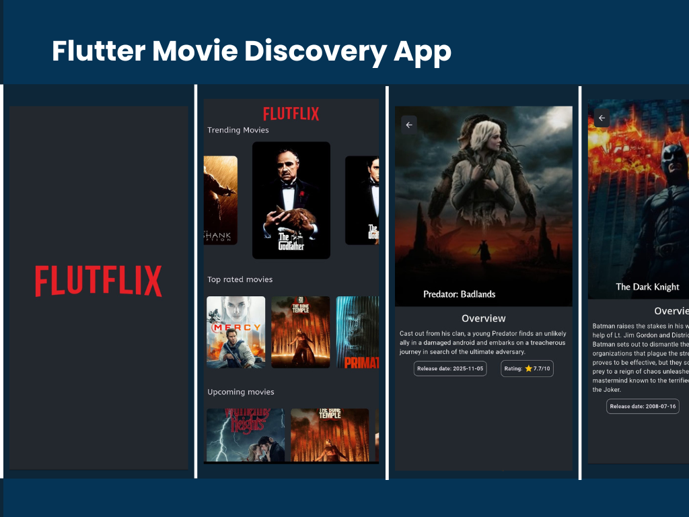

# movieapp - Flutter Movie Discovery App
MovieApp is a modern Flutter-based movie discovery application that allows users to explore trending movies, view detailed information, and check ratings in a clean and cinematic UI.

Built using the Flutter framework, this app integrates with the TMDB API to fetch real-time movie data and display it in a smooth, responsive interface.

## Tech Stack

💙 Flutter (Material 3)

🌐 HTTP package for API integration

🎠 Carousel Slider for featured movies

🎨 Google Fonts for modern typography

🎬 TMDB API for movie data

## ScreenShot
